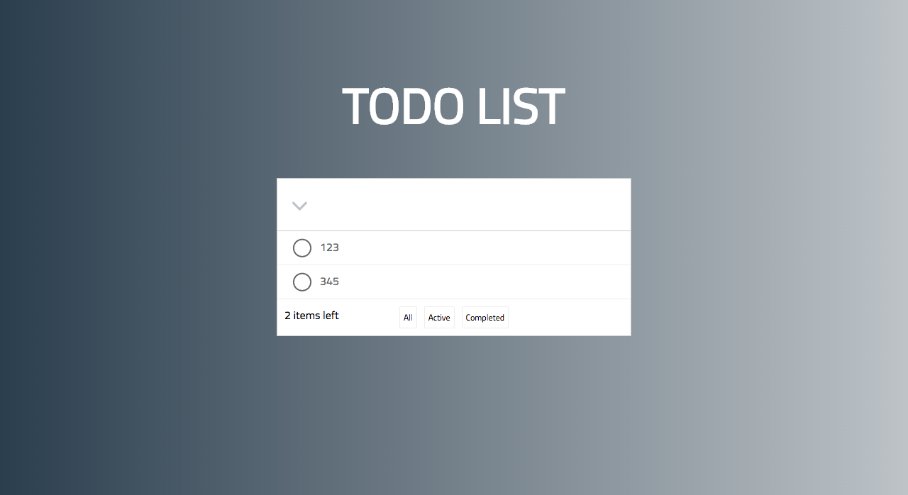

### Introduction
react+redux 实现TODO List


#### 需求列表
* Input：回车 添加Item，左侧按钮全选
* Item：左侧点击完成，右侧点击删除，鼠标移到Item上出现删除按钮,双击修改Item
* 底部：未完成数量，筛选（all、active、completed）

### Start
```
npm start
```

### 文件说明
```
│     
├── public
└── src
    ├── components  Dumb组件，不依赖除了react.js和Dumb组件以外的东西
    ├── container  Smart组件，专门做数据相关的应用逻辑
    ├── redux  redux相关
    │   ├── actions  action方法集合
    │   ├── constants  常量
    │   ├── reducers  reducer集合
    │   ├── fetchs  网络请求
    │   ├── store.js  创建store
    └── util  公共方法
```

### 编码约定
* 私有方法：_开头
* DOM事件：on开头
* dumb state设置: 该state完全不会影响外界状态，也不会因为外界的改变而改变。否则由container prop传入